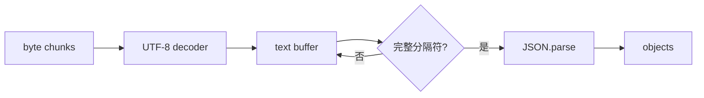

# JSON stream：如何边接收边解析 JSON

> 一句话回忆：JSON stream 不是“每个 chunk 都能 `JSON.parse`”，而是先识别完整记录的边界，再解析完整记录；如果输入必须是一整份巨大 JSON，则需要 token/SAX parser。

**Tags:** `json`, `stream`, `ndjson`, `nodejs`

## 它解决什么问题

普通 `JSON.parse()` 需要完整字符串，但 stream 的 chunk 只是运输单位，边界完全任意：一个 JSON 可以跨多个 chunk，一个 chunk 也可以包含多个 JSON，UTF-8 字符甚至可能被截成两半。

所以必须分别处理两件事：**字节如何安全变成文本**，以及**文本在哪里构成一条完整记录**。

## 核心原理

最简单的办法是使用 framing。以 NDJSON 为例，每条 JSON 后跟一个换行：

```text
{"id":1,"name":"A"}\n
{"id":2,"name":"B"}\n
```

解析器持续做四步：

1. 用 streaming decoder 解码 chunk，保留不完整的多字节字符。
2. 把文本追加到 `pending` buffer。
3. 按换行取出所有完整记录，最后一段继续留在 `pending`。
4. 只对完整记录调用 `JSON.parse()`。



## 最小实现

```js
import { StringDecoder } from 'node:string_decoder';
import { Transform } from 'node:stream';

export class NdjsonParser extends Transform {
  decoder = new StringDecoder('utf8');
  pending = '';

  constructor() {
    super({ readableObjectMode: true });
  }

  _transform(chunk, _encoding, callback) {
    try {
      this.pending += this.decoder.write(chunk);
      const lines = this.pending.split(/\r?\n/);
      this.pending = lines.pop() ?? '';

      for (const line of lines) {
        if (line.trim()) this.push(JSON.parse(line));
      }
      callback();
    } catch (error) {
      callback(error);
    }
  }

  _flush(callback) {
    try {
      const tail = this.pending + this.decoder.end();
      if (tail.trim()) this.push(JSON.parse(tail));
      callback();
    } catch (error) {
      callback(error);
    }
  }
}
```

一次 `_transform` 可以输出 0、1 或多条记录；输入 chunk 和输出对象没有一一对应关系。

## 常用场景

- 持续读取应用日志、子进程 stdout 或事件流。
- 导入、导出无法一次放进内存的大量记录。
- HTTP 接口逐条返回计算结果，而不是等全部完成后再响应。

## 和相关方案怎么选

| 方案 | 核心区别 | 什么时候选 |
| --- | --- | --- |
| NDJSON / JSON Lines | 每行一份完整 JSON | 能控制格式，并希望实现最简单 |
| JSON Text Sequences | 使用 `RS` 字符加换行分隔记录 | 更看重明确 framing 和损坏后的重新同步 |
| Token/SAX parser | 逐 token 解析一整份 JSON | 输入格式必须保持为一个巨大对象或数组 |

## 容易混淆

- `response.body` 是 stream，不代表内容天然可以逐条解析；服务器若发送一个巨大 JSON，仍需 token parser 或等待完整内容。
- `JSON.parse()` 不会告诉你“还差一点”；半个对象通常只会抛出语法错误。
- 字符边界和记录边界是两个问题：decoder 处理前者，framing buffer 处理后者。

## Sources

- [Node.js `StringDecoder`](https://nodejs.org/api/string_decoder.html)
- [NDJSON specification](https://github.com/ndjson/ndjson-spec)
- [RFC 7464: JSON Text Sequences](https://www.rfc-editor.org/rfc/rfc7464.html)
