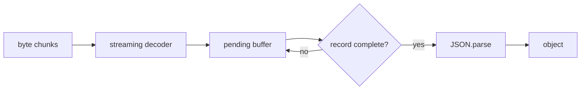

# JSON stream：为什么不是每个 chunk 都能 parse

> 一句话回忆：JSON stream 不是把每个 chunk 都丢给 `JSON.parse()`，而是先用 decoder 保住字符边界，再用 framing 或 parser state 找到完整 JSON value，最后只解析完整 value。

**Tags:** `json`, `stream`, `ndjson`, `nodejs`, `transform`

> 版本说明：Node.js stream / `StringDecoder` 行为基于 v26.7.0 文档，检查于 2026-08-08。

## 它解决什么问题

Stream 的 chunk 是运输边界，不是 JSON 边界。一个 chunk 可能只有半个 UTF-8 字符、半行 NDJSON、半个对象，也可能包含多条记录。`JSON.parse()` 只接受完整 JSON text；把半段输入拿去 parse，只会得到语法错误，无法可靠区分“格式坏了”还是“还没收完”。

所以 JSON stream 的核心不是“更频繁地 parse”，而是先判断哪里已经形成一个完整、可独立解析的单位。

## 核心原理

最常见做法是先设计 framing。NDJSON 就是“一行一条 JSON”：解析器持续接收 byte chunk，用 `StringDecoder` 处理跨 chunk 的多字节字符，再把文本追加到 `pending`。每次只取出已经遇到换行符的完整行，对这些行调用 `JSON.parse()`；最后不完整的一段继续留在 `pending`，等下个 chunk 或 `_flush()`。

这也是 Transform stream 的特点：一次 `_transform` 可以输出 0、1 或多条对象；输入 chunk 和输出对象没有一一对应关系。



## 最小实现

```js
import { StringDecoder } from 'node:string_decoder';
import { Transform } from 'node:stream';

export function ndjsonParser() {
  const decoder = new StringDecoder('utf8');
  let pending = '';

  return new Transform({
    readableObjectMode: true,
    transform(chunk, _enc, cb) {
      try {
        pending += decoder.write(chunk);
        const lines = pending.split(/\r?\n/);
        pending = lines.pop() ?? '';
        for (const line of lines) if (line.trim()) this.push(JSON.parse(line));
        cb();
      } catch (err) { cb(err); }
    },
    flush(cb) {
      try {
        const tail = pending + decoder.end();
        if (tail.trim()) this.push(JSON.parse(tail));
        cb();
      } catch (err) { cb(err); }
    },
  });
}
```

这里有两层缓存：`StringDecoder` 处理“半个字符”，`pending` 处理“半条记录”。如果最后一行没有换行符，`flush` 会在输入结束时再尝试解析它。

## 常用场景

- 读取日志、子进程 stdout、Kafka dump 这类一条条追加的数据。
- 导入、导出无法一次放进内存的大量 JSON 记录。
- HTTP/SSE 接口逐条返回进度、事件或 AI token payload。

## 和相关方案怎么选

| 方案 | 核心区别 | 什么时候选 |
| --- | --- | --- |
| NDJSON / JSON Lines | 换行就是记录边界 | 能控制数据格式，想要最简单实现 |
| JSON Text Sequences | 用 `RS` 控制字符标记记录 | 更在意损坏后的重新同步 |
| Token/SAX parser | 逐 token 解析一整份 JSON | 输入必须保持巨大对象或数组 |

## 容易混淆

- `response.body` 是 stream，不代表内容天然能逐条 `JSON.parse()`；服务器也必须提供记录边界。
- `JSON.parse()` 不是增量 parser；半个对象通常只是语法错误。
- Transform 不是“一个 chunk 变一个 chunk”，而是“任意 chunk 输入，按状态吐出完整结果”。

## Sources

- [Node.js Stream: implementing a Transform stream](https://nodejs.org/api/stream.html#implementing-a-transform-stream)
- [Node.js StringDecoder](https://nodejs.org/api/string_decoder.html)
- [NDJSON specification](https://github.com/ndjson/ndjson-spec)
- [RFC 7464: JSON Text Sequences](https://www.rfc-editor.org/rfc/rfc7464.html)
