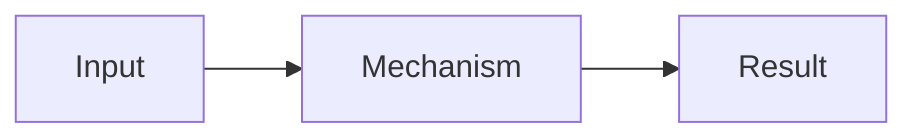

# <概念或问题>

> 一句话回忆：<只读这一句也能恢复最重要的 mental model。>

**Tags:** `<tag-1>`, `<tag-2>`

<!-- 如果行为依赖版本，再保留下面这行。 -->
> 版本说明：基于 `<version>`，检查于 `<YYYY-MM-DD>`。

## 它解决什么问题

<用一小段说明为什么需要它，以及没有它会发生什么。>

## 核心原理

<按因果顺序解释 2–5 个关键步骤。区分 mental model 与真实实现。>

<!-- 只有结构、数据流或状态变化不画图就难以理解时才保留。最多一张。 -->

## 最小例子

<只保留能证明核心机制的代码、目录结构或输入输出。>

## 常用场景

<!-- 可选；最多 3 条。没有具体场景就删除整节。 -->

- <具体场景>

## 和相关方案怎么选

<!-- 可选；最多 3 个方案。比较不改变理解或选择时，删除整节。 -->

| 方案 | 核心区别 | 什么时候选 |
| --- | --- | --- |
| `<方案>` | <一句话> | <一句话> |

## 容易混淆

<!-- 可选；最多 3 条，只写高价值纠正。 -->

- <常见错误 mental model → 正确理解>

## Sources

<!-- 事实性或版本敏感的笔记保留 2–5 个 primary sources。 -->

- [<Official documentation or standard>](<url>)
